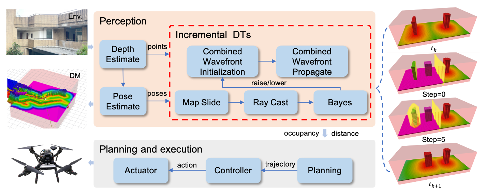

# *gridmap*: 3D sliding grid map for motion planning

The repository _gridmap_ provides map construction methods for motion planning, including sliding occupancy grid map (SOGM), inflated map and distance map (DM). And they contain the occupancy information, the virtual occupancy information, and the distance information, respectively. In addition, there is a global grid map for saving and visualization based on a hash table. We aim to ensure that our core codes are ROS-independent.

# modules

There are three functional modules for different motion planning demands. They can be used in robots respectively. _PlanMapBase_ is an abstract base class that provides a uniform interface. 

## SOGMMap

The SOGMMap module provides a fixed-memory-consuming sliding occupancy grid map that can be moved with the robot.

## InflationMap

The InflationMap module provides a inflated map that can be moved with the robot based on the SOGM. And it is designed by our previous work, Fiimap.

@article{li2023fiimap,
title={Fiimap: Fast incremental inflate mapping for autonomous mav navigation},
author={Li, Yong and Wang, Lihui and Ren, Yuan and Chen, Feipeng and Zhu, Wenxing},
journal={Electronics},
volume={12},
number={3},
pages={534},
year={2023},
publisher={MDPI}
}

## InESDFMap

The inESDFMap module provides a fast incremental distance transform methods to construct the distance map (DM) based on the SOGM.

Yong Li, Lihui Wang, Yuan Ren. "Combined Wavefront-based 3D Distance Transform for Online Motion Planning of Unmanned Aerial Vehicles."

<p align = "center">
<!--  -->

</p>

<p align = "center">

</p>


# Test on the corridor dataset.

## step1: prepare data
There is a *corridor.bag* dataset. The entire file can be found at https://pan.baidu.com/s/1TRmudWfDG11BMxEWUBvZig. The access key is "12re". Additionally, a slice of the dataset can be found in the dataset directory.


## step2: compile and run
We have tested on the ubuntu18.04 and ROS melodic.
```
catkin_make
```

```
rosbag paly corridor.bag
roslaunch gridmap sogm_map.launch
roslaunch gridmap inflation_map.launch
roslaunch gridmap esdf_map.launch
```

<p align = "center">


</p>


# Licence

The source code is released under [GPLv3](http://www.gnu.org/licenses/) license.

# Maintaince

We are still working on extending the proposed system and improving code reliability.

For any technical issues, please contact Yong Li (230228932@seu.edu.cn).
